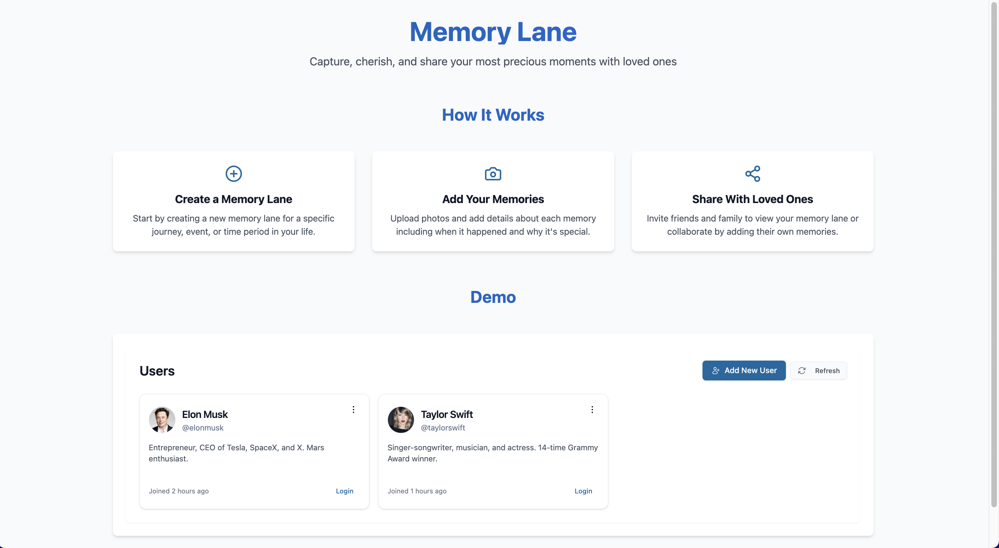
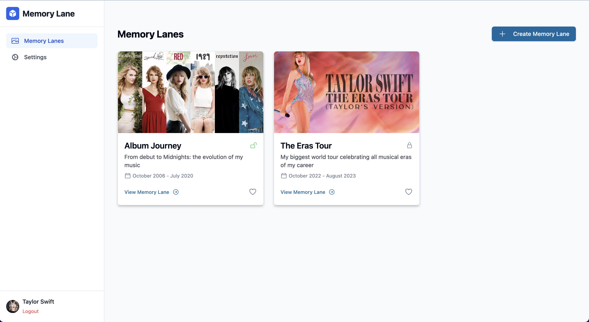
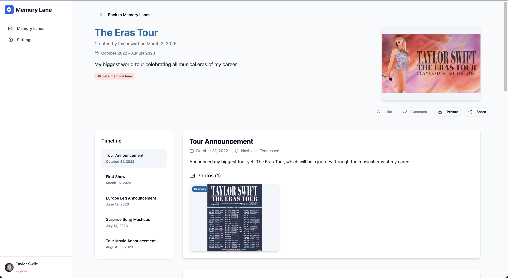
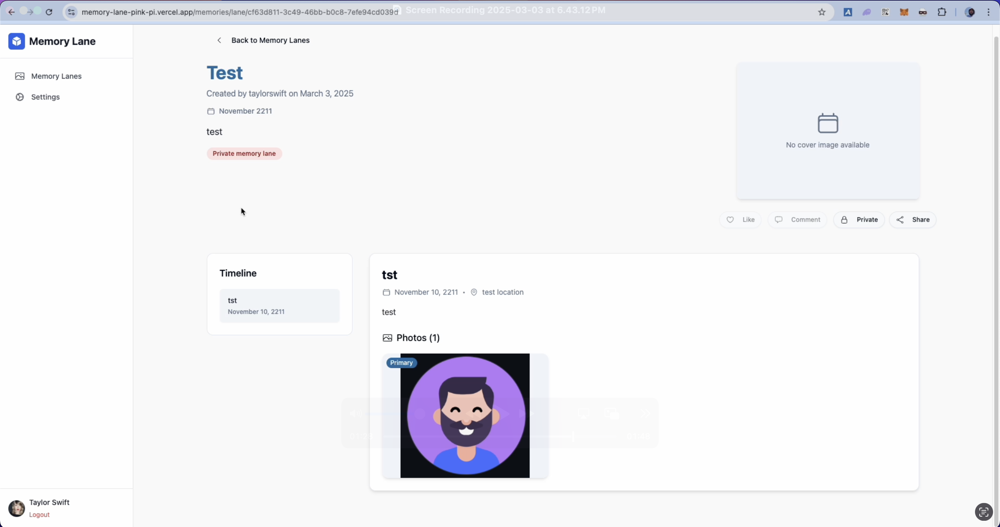

# Memory Lane

A web application for capturing and sharing life moments in chronological collections.

## Project Overview

Memory Lane solves the problem of scattered memories across different platforms by providing a centralized space for users to create, organize, and share their important life moments. After conducting discovery calls with users, we found they were struggling with sharing memories across social media, messaging apps, and email. Memory Lane addresses this pain point by offering a dedicated platform where users can:

- Create chronological collections of memories ("Memory Lanes")
- Add events with images, descriptions, and dates to each Lane
- Share their Memory Lanes with friends and family through unique links

## Features

### Core Functionality

- **User Management**: Create and edit user profiles with customizable avatars
- **Memory Lane Creation**: Build chronological collections of memories with cover images
- **Event Management**: Add events to Memory Lanes with titles, descriptions, dates, locations, and images
- **Image Handling**: Upload, crop, and compress images for optimal performance
- **Sharing**: Share Memory Lanes through unique, public-accessible links
- **Responsive Design**: Fully responsive UI that works across desktop and mobile devices

### User Experience

- **Interactive Timeline**: Visual representation of chronological events
- **Image Gallery**: View event images in an expandable gallery
- **Smooth Animations**: Framer Motion transitions enhance the browsing experience
- **Dark Mode Support**: Adaptable UI for both light and dark preferences
- **Drag & Drop**: Intuitive image upload experience

### Screenshots


_The landing page provides a clear introduction to Memory Lane._


_The Memory Lanes tab lists all the uploaded Memory Lanes of the user._


_A detailed view of a memory lane with its timeline of events._

### Video Demonstration

You can view a video demonstration of Memory Lane in action by clicking the link/image below:

[](./screenshots/recording.mov)

_The video provides a comprehensive overview of the application's features and user experience._

## Technical Implementation

### Architecture

The project follows a modern React architecture with a clean separation of concerns:

- **Component Structure**: Organized by feature and responsibility

  - `/layout`: Application layout components
  - `/pages`: Page-level components
  - `/features`: Domain-specific feature components
  - `/ui`: Reusable UI components
  - `/common`: Utility components

- **Data Management**:

  - Supabase for backend data and file storage
  - Context-based state management

- **Routing**:
  - React Router for navigation
  - Public sharing routes - can be extended based on the Authentication

### Database Design

The application uses the following data models:

- **User**: Profile information and authentication
- **MemoryLane**: Collection of chronological events
- **Event**: Individual memories within a lane
- **Image**: Photos associated with events

### API Integration

The application interacts with:

1. **Supabase API**: For persistent data storage and retrieval
2. **Storage API**: For image uploads and management

### Technical Highlights

- **Image Processing Pipeline**: Images are processed through a pipeline that includes:

  - Client-side compression
  - Interactive cropping
  - Efficient storage
  - Optimized loading

- **Responsive UI Design**: The application is fully responsive with:

  - Flexible grid layouts
  - Adaptive navigation
    > **Warning**: Mobile UI Layout not supported yet

## Tech Stack

- **Frontend**:

  - React 18
  - TypeScript
  - Tailwind CSS
  - Framer Motion for animations
  - React Router for navigation
  - Shadcn UI components

- **Backend & Storage**:

  - Supabase for database and storage

- **Build Tools**:
  - Vite
  - ESLint
  - TypeScript

## API Updates

The original API has been expanded to support the following operations:

- **User Management**: CRUD operations for users
- **Memory Lane Management**: Create, read, update, and delete memory lanes
- **Event Management**: Add and manage events within memory lanes
- **Image Handling**: Upload, store, and retrieve images
- **Sharing**: Generate and validate share links

The API schema has been updated to accommodate the data model described above, with tables for users, memory lanes, events, and images.

## Future Improvements

While the current implementation meets all requirements, there are several areas for future enhancement:

1. **Mobile Responsive Design**: Update the UI to support mobile screen displays as well
2. **Advanced Media Support**: Add support for videos and audio recordings
3. **Social Features**: Comments, likes, and reactions to shared memory lanes
4. **Export Options**: Allow users to export memory lanes as PDFs or digital albums
5. **Improved Search**: Full-text search across memory lanes and events

## UI Implementation

The application features a clean, intuitive design with a focus on showcasing memories:

- **Timeline View**: Chronological display of events with visual indicators
- **Gallery View**: Responsive image grid for browsing memories
- **Detail View**: Expanded view for individual events with full details
- **Sharing Interface**: Clean public view for shared memory lanes

## Development Approach

This implementation followed a user-centered design approach:

1. **Requirements Analysis**: Understanding the core needs of the task to be done
2. **Component-Based Development**: Building reusable pieces
3. **Iterative Testing**: Ensuring quality through continuous testing
4. **Performance Optimization**: Ensuring smooth experience even with many images
5. **Accessibility Considerations**: Making the app usable for all - Mobile UI design yet to be b supported!

## Setup and Installation

1. **Clone the repository**

   ```bash
   git clone [your-repo-url]
   cd memory-lane
   ```

2. **Install dependencies**

   ```bash
   npm install
   ```

3. **Environment setup**
   Create a `.env` file with your Supabase credentials:

   ```
   VITE_SUPABASE_URL=your_supabase_url
   VITE_SUPABASE_ANON_KEY=your_supabase_anon_key
   ```

4. **Run the development server**

   ```bash
   npm run dev
   ```

## Conclusion

Memory Lane provides a comprehensive solution for the identified problem, offering users a dedicated platform to create, organize, and share their cherished memories. The implementation prioritizes user experience while maintaining a clean, maintainable codebase with modern front-end practices.
